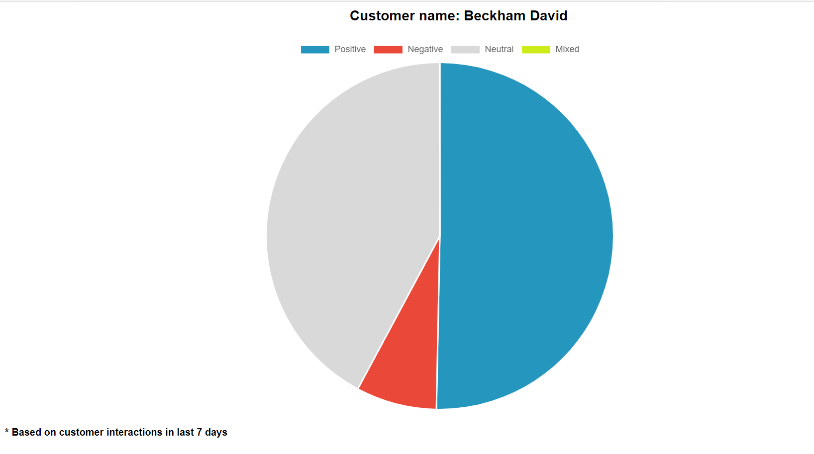

**Integrate eGain messaging hub with AWS Comprehend**

Traditionally most organizations were leveraging survey as a primary tool to measure the customer satisfaction. With the improvement in AI technologies in last few years, getting insights on how your customers are talking to you will paint a better picture. Conversations transcripts are one of the source for measuring the customer satisfaction. This repository contains an example application to determine the sentiments of a conversation in eGain messaging hub. Using sentiment analysis, this information can help paint a more accurate picture of the health of customer relationships with your service agents. This example enables developers to pull the eGain conversation data and sent to AWS comprehend. Developers can use other conversational analytics tool such as Callminer, Clarabridge , Microsoft text analytics as well. You can also use this pattern for getting more insights such as product information from the conversation. 

**Flow** 
1. Cloudwatch event rule is configured to execute the lambda every x hours
2. eGain chat transcripts of closed chats are fetched at regular interval using eGain messaging hub provided interaction APIs. 
3.1 Tidemark maintained to define start and end date of batch
3.2. Chat transcripts are processed to separate agent and customer messages
4. Chat transcripts are forwarded to AWS comprehend sentiment analyzer
5. Sentiment details of the chat transcript are returned from the AWS Comprehend service
6. Tidemark and batch status is updated
7. Transcripts along with sentiments are fed to HTML and written to S3 bucket.

**Note**
1. Chats with anonymous customers will not be processed.
2. Only chats in English will be processed.
3. The generated HTML will be stored in ${S3_bucket}/chat/sentiment-analysis/output

**Pre-requsiites**
1. Git client, can be downloaded from https://git-scm.com/downloads
2. eGain Cloud advisor credentials availability 
3. AWS cloud credentials with AWS Comprehend, Lambda and all mentioned below services from "Additional Information" enabled
4. AWS account with access to eGain URL
5. Role with permissions defined in "deployment/sentimentAnalyserrole.json" created before the deployment and used while deploying the application
6. Simple email service configured for AWS account, if required
7. AWS CLI, please refer https://docs.aws.amazon.com/cli/latest/userguide/cli-chap-install.html to install and configure AWS CLI
8. SAM CLI, please refer https://docs.aws.amazon.com/serverless-application-model/latest/developerguide/serverless-sam-cli-install-windows.html to install and configure SAM CLI
9. You need to run the 'aws configure' to configure the aws profile for deployment

**Installation**
1. Clone this repository
2. Navigate to deployment folder and edit the egps-chat-sentiment-analysis-config.properties file with appropriate parameters. Proxy details should be used if required   to access eGain. Please refer below table
  
  | Property        | Description |
  | ------------- |:-------------:|
  | AWS_REGION    | Region where the application will be deployed |
  | CODE_DEPLOY_BUCKET | S3 bucket where code will be deployed and output will be stored |
  | LAMBDA_MASTER_ROLE | ARN of lambda role created with the mentioned policy      |
  | DEPLOYMENT_ENVIRONMENT | Environment for which app is being deployed |
  | LOGGER_LEVEL | Logger level to print cloudwatch logs |
  | DATA_START_POINT | Starting point to read the data from time period |
  | EGAIN_API_USERNAME | eGain username for user with all required permissions |
  | EGAIN_API_PASSWORD | eGain password for user with all required permissions |
  | EGAIN_API_PROXY_IP | Proxy IP address to connect to eGain|
  | EGAIN_API_PROXY_PORT | Port number of proxy to connect to eGain|
  | DISABLE_PROXY | Boolean to specify if proxy should be enabled |
  | EGAIN_API_PROXY_USERNAME | Username of proxy to connect to eGain |
  | VPC_ID | ID of AWS VPC |
  | SECURITY_GROUP_ID | ID of security groups |
  | SUBNET_IDS | Comma separated subnet ids |
  
3. On command prompt, execute egps-chat-sentiment-analysis-deploy.bat file, it will start deployment and progress can be seen on the command prompt.
4. Upon successful installation, Cloudwatch event will be created.

**Post Installation**
1. In the first run job will pick activities from date entered in DATA_START_POINT in config file. The date will be modified for each run to current date and        activities will be picked after the updated date. To modify the start date, navigate to egps-${DeploymentEnvironment}-chat-sentiment-analysis-tidemark table in DynamoDB and update the ACTIVITY_VALUE_FROM value.
2. To modify eGain host URL or proxy details, navigate to Parameter Store in AWS Systems Manager and edit below properties:
  * /egps/connected-apps/${DeploymentEnvironment}/chat-sentiment-analysis/egain-api-host
  * /egps/connected-apps/${DeploymentEnvironment}/chat-sentiment-analysis/egain-api-proxy-ip
  * /egps/connected-apps/${DeploymentEnvironment}/chat-sentiment-analysis/egain-api-proxy-port
3. To modify eGain login credentials, navigate to AWS Secrets manager and edit below properties:
  * egps-${DeploymentEnvironment}-chat-sentiment-analysis-secrets => egain-api-user-credential

**Getting Started**
Configure eGain  - TBD
Create eGain User with Chat Advisor role and platform license
client app etc TBD for R21   Screenshots 

**Additional Information**
This Integration leverage the below services from AWS
1. AWS Lambda - Processed chat transcripts and comprehend call for sentiment analysis
2. Amazon Cloud Watch  - Triggers lambda at regular interval
3. Amazon Secrets Manager - Stores required sensitive information 
4. Amazon Dynamo DB  - Stores tidemarks for batch processing of data
5. Parameter Store - Stores required parameters
6. SES (simple email service) - Sends analyzed data to registered email address ( optional)
7. AWS Comprehend - Sentiment analysis service which returns sentiment of the input text. 
